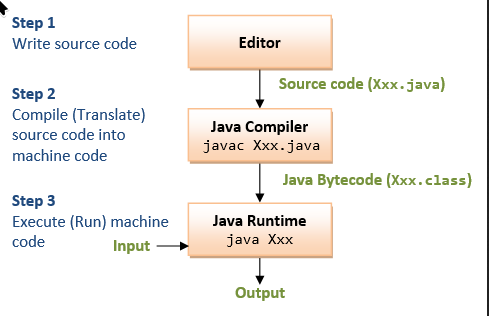

# *Estudo de Java*

## Introdução
**Java** é uma linguagem de programação de alto nível, orientada a objetos, amplamente usada para desenvolver aplicações
multiplataforma. Ela é compilada para um código intermediário chamado *bytecode*, que não é executado diretamente pelo
sistema operacional, mas sim interpretado pela **Java Virtual Machine (JVM)**, permitindo que o mesmo programa rode em
diferentes sistemas.

O processo funciona em duas etapas: primeiro, o código-fonte `.java` é compilado pelo compilador `javac` em bytecode
`.class`; depois, a JVM interpreta ou just-in-time (JIT) compila esse bytecode em código nativo durante a execução,
garantindo portabilidade e eficiência.



## Instalação do Java no Linux

Para programar em Java, você precisa instalar o **JDK (Java Development Kit)**, que inclui o compilador `javac` e a JVM.

```bash
# Debian/Ubuntu
sudo apt update
sudo apt install openjdk-17-jdk
java -version
javac -version

# Fedora/Red Hat
sudo dnf update
sudo dnf install java-17-openjdk-devel
java -version
javac -version

# Configuração opcional da variável JAVA_HOME
echo "export JAVA_HOME=$(dirname $(dirname $(readlink -f $(which javac))))" >> ~/.bashrc
source ~/.bashrc
```bash